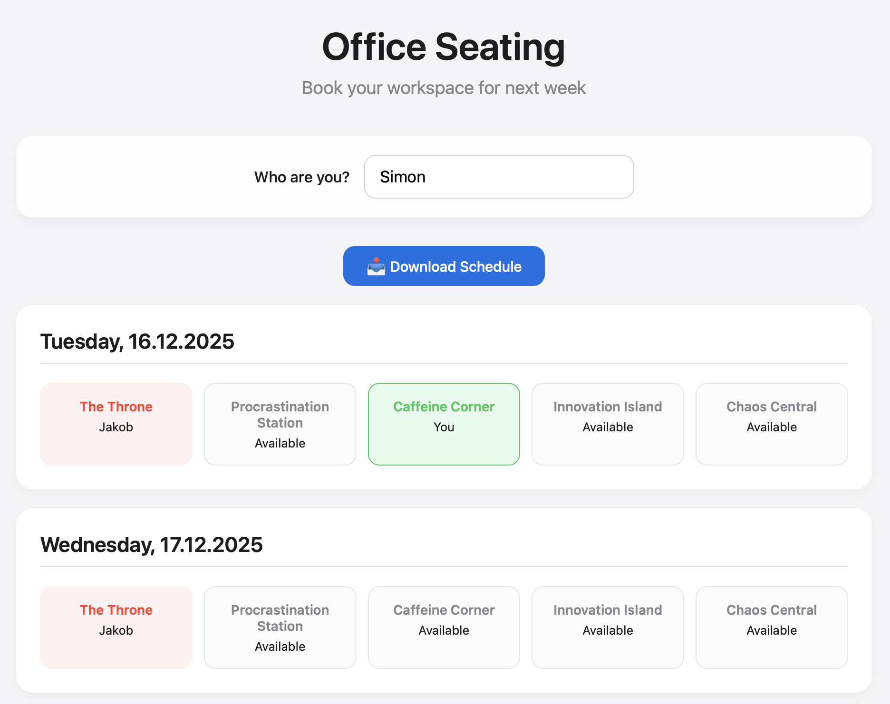

# Office Desk Booking System

A simple, elegant web-based desk booking system built with Flask and Python. Perfect for small offices managing shared workspace reservations.

## Features

- 📅 **Current & Next Week Booking** - Book desks for today through the end of next week
- 🪑 **5 Desks** - The Throne, Procrastination Station, Caffeine Corner, Innovation Island, and Chaos Central
- 👤 **Personal Bookings** - See your bookings highlighted in green
- 🚫 **Conflict Prevention** - Can't double-book desks or book multiple desks per day
- ❌ **Cancel Bookings** - Hover over your bookings to cancel them
- 📥 **Excel Export** - Download all bookings as an Excel file
- 🎨 **Modern UI** - Clean, elegant interface with smooth interactions
- 🇩🇪 **German Holiday Support** - Automatically excludes Bavarian holidays

## Screenshots



The interface shows a weekly view with all available and booked desks at a glance.

## Installation

### Prerequisites

- Python 3.13+ (tested on Python 3.13)
- pip

### Setup

1. Clone this repository:
```bash
git clone https://github.com/yourusername/office-desk-booking.git
cd office-desk-booking
```

2. Create a virtual environment:
```bash
python3 -m venv .venv
source .venv/bin/activate  # On Windows: .venv\Scripts\activate
```

3. Install dependencies:
```bash
pip install -r requirements.txt
```

## Project Structure

```
Deskbooking/
├── src/              # Application source code
│   ├── app.py        # Main Flask application
│   └── templates/    # HTML templates
├── tests/            # Test files
│   └── test_app.py   # Application tests
├── config/           # Configuration files
│   └── config_example.py  # Example configuration
├── scripts/          # Setup and utility scripts
│   ├── setup.sh      # Linux/Mac setup script
│   └── setup.bat     # Windows setup script
├── docs/             # Documentation
│   ├── QUICKSTART.md
│   ├── CONTRIBUTING.md
│   ├── PUBLISHING_GUIDE.md
│   └── READY_TO_PUBLISH.md
├── requirements.txt  # Python dependencies
├── README.md         # This file
├── LICENSE           # MIT License
└── example.png       # Screenshot
```

## Usage

1. Start the Flask server:
```bash
python src/app.py
```

2. Open your browser and navigate to:
```
http://127.0.0.1:5001
```

3. Enter your name and start booking desks!

## How It Works

### Booking a Desk
1. Enter your name in the input field
2. Click on any available desk (gray background)
3. Your booking appears in green with "You"

### Canceling a Booking
1. Hover over your booking (green desk)
2. It turns red and shows "Click to Cancel"
3. Click to cancel the booking

### Viewing Bookings
- **Available desks**: Gray background, shows "Available"
- **Your bookings**: Green background, shows "You"
- **Others' bookings**: Red background, shows the person's name

### Downloading Schedule
Click the "📥 Download Schedule" button to export all bookings as an Excel file.

## Configuration

You can customize the desk names in `src/app.py`:

```python
df = pd.DataFrame(columns=['Date', 'The Throne', 'Procrastination Station', 'Caffeine Corner', 'Innovation Island', 'Chaos Central'])
```

To change the holiday region, modify:

```python
BAVARIAN_HOLIDAYS = holidays.Germany(subdiv='BY')
```

Available German subdivisions: BW, BY, BE, BB, HB, HH, HE, MV, NI, NW, RP, SL, SN, ST, SH, TH

## Data Storage

Bookings are stored in `office_seating.xlsx` in the application directory. This file is automatically created on first run.

## Tech Stack

- **Backend**: Flask (Python)
- **Frontend**: Vanilla JavaScript, HTML5, CSS3
- **Data Storage**: Excel (via pandas and openpyxl)
- **Styling**: Modern, clean design system

## API Endpoints

- `GET /` - Main application interface
- `GET /api/schedule` - Get booking schedule (JSON)
- `POST /api/book` - Book a desk
- `POST /api/cancel` - Cancel a booking
- `GET /api/download` - Download Excel file

## License

MIT License - see LICENSE file for details

## Contributing

Contributions are welcome! Please feel free to submit a Pull Request.

## Author

Created for managing office desk bookings in a fun and efficient way.

## Troubleshooting

**Port 5001 already in use?**
- On macOS, port 5000 is used by AirPlay. The app uses port 5001 by default.
- To change the port, edit `src/app.py` and modify:
```python
app.run(debug=False, host='127.0.0.1', port=YOUR_PORT)
```

**Excel file errors?**
- Ensure you have write permissions in the application directory
- The Excel file is created automatically on first run

## Future Enhancements

- User authentication
- Email notifications
- Multi-office support
- Mobile app
- Calendar integration
